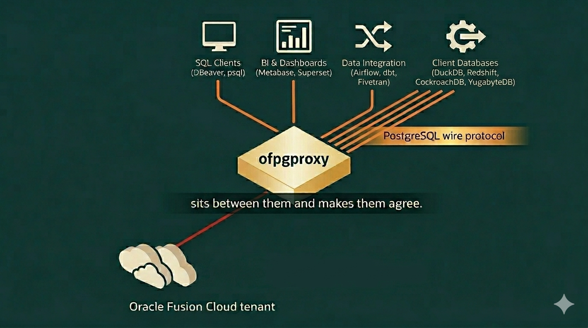

<div align="center">
  <h1>✨ ofpgproxy</h1>
  <p><strong>Expose Oracle Fusion Cloud as a native PostgreSQL database.</strong></p>
  <p>Connect Metabase, Superset, Grafana, dbt, and DBeaver directly to your Fusion tenant using native PostgreSQL drivers. Zero custom connectors. Just plug in, type <code>SELECT</code>, and watch the data stream.</p>

  <br />
  
  

  <br />
  <br />

  <a href="https://github.com/krokozyab/ofpgproxy/releases/latest"></a>
  
  

  <br />
  <br />
</div>

Oracle Fusion Cloud's BI Publisher is the only sanctioned read-path out of a SaaS tenant. It speaks SOAP, returns base64-wrapped XML, and every analytics tool your team *actually* wants to use expects PostgreSQL. 

**`ofpgproxy` sits between them and makes them agree.**

```text
  SQL Clients       BI & Dashboards     Data Integration
 (DBeaver, psql)  (Metabase, Superset)   (DuckDB, dbt)
         │                 │                   │
         └─────────────────┼───────────────────┘
                           │   ✨ PostgreSQL wire protocol
                           ▼
                   ┌───────────────┐
                   │   ofpgproxy   │
                   └───────────────┘
                           │
                           │   ⚡️ SOAP (BI Publisher · RP_ARB.xdo)
                           ▼
                  Oracle Fusion Cloud tenant
```

### 🎯 PostgreSQL Compatibility Layers

PostgreSQL compatibility isn't just about the port number. `ofpgproxy` bridges the gap across the layers that matter for analytics:
*   **Wire Protocol:** Native support for Postgres connections (JDBC, ODBC, libpq, pgx, psycopg).
*   **System Catalogs:** Emulates `pg_catalog` and `information_schema` so clients instantly discover 30,000+ tables.
*   **SQL Dialect:** Translates Postgres idioms (`ILIKE`, `date_trunc`, `~`, `EXCEPT`) into Oracle SQL on the fly.
*   *Note: As a read-only analytical proxy, it intentionally does not support transactions, DML, or Postgres extensions.*

Because of this deep emulation, it works natively with:
*   **SQL Clients:** DBeaver, DataGrip, TablePlus, pgAdmin, `psql`.
*   **BI & Dashboards:** Superset, Metabase, Redash, Grafana, Tableau, Power BI.
*   **Data Integration:** DuckDB, `postgres_fdw`, dbt, `dblink`.

---

## 💡 Why you need this

* **Stop fighting the BI bottleneck:** Plug Metabase, Superset, or Grafana directly into Fusion. No more waiting weeks for custom data engineering pipelines just to see a basic chart.
* **Give analysts their tooling back:** DBeaver tree navigation, autocomplete, query history, and result grids all work natively. 
* **Seamless data pipelines:** Use `postgres_fdw` to bring Fusion live into your reporting DB, or let DuckDB pull it straight into your Jupyter notebooks.

## 🚀 60-Second Magic Start

**Prerequisite:** Deploy the `RP_ARB.xdo` BI Publisher report to your Oracle Fusion tenant. You can download the report catalog from [krokozyab/ofjdbc/otbireport](https://github.com/krokozyab/ofjdbc/tree/master/otbireport).

```bash
# 1. Grab the binary + metadata catalog from the latest release:
#    https://github.com/krokozyab/ofpgproxy/releases/latest
#    Two .zip files — double-click to extract on macOS Finder or Windows Explorer.
./ofpgproxy --version

# 2. Point it at your Oracle Fusion tenant
FUSION_HOST=fa-xxxx.oraclecloud.com FUSION_AUTH_TYPE=sso \
  ./ofpgproxy --metadata-path ./metadata.db

# 3. Connect with ANYTHING that speaks Postgres
psql -h localhost -p 5433 -U anyone -d any \
  -c "SELECT period_name, period_year FROM gl_periods LIMIT 5"
```

*First run opens your IdP in Chrome. After login, the SSO token is held in-process. DBeaver, Metabase, and Grafana can connect to the same port without re-authenticating. If your tenant supports it, standard basic authentication (`--auth=password`) is also available.*

👉 **[Read the Full Quick Start Guide](doc/quickstart.md)**

## 🦸‍♂️ What you get out of the box

* 🔌 **Zero Custom Glue.** Wire-protocol passthrough means no specialized SDKs or custom integrations are required. If your tool speaks PostgreSQL, it already speaks Fusion.
* 📚 **30,000+ Tables Pre-Indexed.** Ships with a lightning-fast DuckDB catalog. `\d`, `information_schema.tables`, Metabase schema sync, and dbt `--full-refresh` work immediately.
* 🌊 **Memory-Efficient Streaming.** Results flow through the proxy as they arrive from Oracle. The proxy itself doesn't buffer massive datasets in memory, keeping its resource footprint tiny.
* 🧠 **Pagination Support.** Transparently handles `OFFSET` and `LIMIT` / `FETCH` clauses. IDEs like DBeaver and DataGrip can fetch just the first page of results, avoiding massive full-table scans when you're just exploring data.
* 🪄 **PostgreSQL → Oracle SQL Auto-Translation.** `TRUE/FALSE`, `ILIKE`, regex `~`, `date_trunc`, `EXCEPT`, `WITH RECURSIVE`, and more are translated automatically on the fly. [See the full matrix](doc/sql-compat.md).
* 🛡️ **Real PostgreSQL Errors.** `ORA-00942` seamlessly becomes SQLSTATE `42P01 undefined_table`. Your tools react exactly as they should.
* 🔒 **Read-Only by Design.** BI Publisher can't write, and neither will the proxy. No accidental DML. Sleep soundly.
* 🧪 **Built-in Translator Playground.** Launch with `--translate-http 127.0.0.1:8080` to get an offline web UI (and JSON endpoint) that shows, for any SQL you paste, which router branch it hits and the rewritten Oracle / DuckDB statement — no Fusion connection needed. [Details](doc/configuration.md#sql-translator-playground).

## 📖 Documentation

| Guide | Description |
|---|---|
| 🏎️ [**Quick Start**](doc/quickstart.md) | Zero to your first `SELECT` in 5 minutes |
| ⚙️ [**Configuration**](doc/configuration.md) | Flags, environment variables, and signals |
| 🔑 [**Authentication**](doc/auth.md) | SSO, password, and token-file modes |
| 🤝 [**Connecting clients**](doc/clients.md) | Recipes for psql, DBeaver, DuckDB, `postgres_fdw`, `dblink`, pgx/psycopg/pgJDBC |
| 🍳 [**Copy-paste recipes**](doc/recipes.md) | Ready-to-run scripts for DuckDB `ATTACH`, PG → proxy via `dblink` and `postgres_fdw`, with JOIN/CTAS examples |
| 🔀 [**SQL compatibility**](doc/sql-compat.md) | Every PG→Oracle rewrite + known limitations + workarounds |
| 🗂️ [**Metadata catalog**](doc/metadata.md) | What `metadata.db` contains and how to refresh it |
| 🚑 [**Troubleshooting**](doc/troubleshooting.md) | Common errors, what they mean, and how to fix them |

## 🕹️ How it feels in practice

You run the binary. You get a PostgreSQL endpoint on `:5433` — except the tables inside are Oracle Fusion's. 

Everything that speaks PG just connects: `psql`, DBeaver, Metabase, Grafana, dbt, a Python script using psycopg, another PostgreSQL database using `postgres_fdw`, a JVM service on pgJDBC. Each query transparently becomes a BI Publisher SOAP call under the hood; rows stream back as the XML arrives. 

**Your tools never find out it isn't a real PostgreSQL database.**

*Actively developed. Expect rough edges on exotic SQL shapes — see [SQL compatibility](doc/sql-compat.md) for the current matrix, and open an issue when you hit one.*

## 📜 License

This project is licensed under the [Apache License, Version 2.0](LICENSE).
s.
