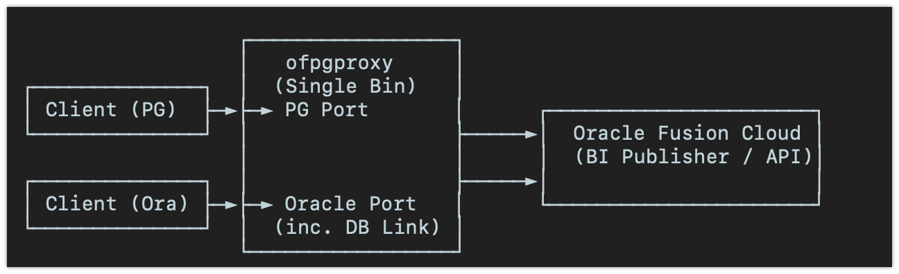

<div align="center">
  

  <h1>✨ ofpgproxy</h1>
  <p><strong>Talk to Oracle Fusion Cloud in native Oracle SQL*Net — <code>sqlplus</code>, SQL Developer, SQLcl, ojdbc, even a real Oracle database's own <code>dblink</code>.</strong></p>
  <p>PostgreSQL wire protocol comes along for the ride too — Metabase, Superset, dbt, and DBeaver connect just as natively. Same binary, same tenant, your pick of wire.</p>

  <br />

  

  <br />
  <br />

  <a href="https://github.com/krokozyab/ofpgproxy/releases/latest"></a>
  
  
  
  <!--[](https://github.com/krokozyab/ofpgproxy/releases)-->

  <br />
  <br />
</div>

Oracle Fusion Cloud's BI Publisher is the only sanctioned read-path out of a SaaS tenant. It speaks SOAP, returns base64-wrapped XML — and every Oracle client you already own (`sqlplus`, a reconciliation script over `dblink`, SQL Developer, an ojdbc-based service) expects the real Oracle wire protocol instead.

**`ofpgproxy` sits between them and makes them agree — one binary, two wire protocols, the same Fusion tenant underneath.**

```text
   Oracle clients                     SQL / BI / Data tools
 (sqlplus, SQL Developer,            (psql, DBeaver, Metabase,
  SQLcl, dblink, ojdbc)               Superset, DuckDB, dbt)
         │                                     │
         │  Oracle SQL*Net (TNS/TTC)           │  PostgreSQL wire protocol
         ▼                                     ▼
                    ┌───────────────┐
                    │   ofpgproxy   │
                    └───────────────┘
                            │
                            │  SOAP (BI Publisher · RP_ARB.xdo)
                            ▼
                   Oracle Fusion Cloud tenant
```

### 🎯 Native Oracle, no rewrite required

Point existing Oracle tooling straight at Fusion — nothing to port:
*   **`sqlplus` / SQL Developer / SQLcl** — point them at Fusion and run your `SELECT`s, no rewrite. Read-only by design.
*   **A real Oracle database's own `dblink`** — reconciliation scripts, migration validation, anything already written to query a remote Oracle schema keeps working unchanged.
*   **ojdbc / python-oracledb** — service code that already speaks the Oracle driver connects without touching a line.
*   *Note: read-only by construction — BI Publisher can't write, so DML is rejected regardless of client.*

### 🐘 PostgreSQL, as an additional wire

The same tenant is also reachable over the PostgreSQL wire protocol — useful when your tooling is Postgres-native instead of Oracle-native:
*   **Wire Protocol:** Native support for Postgres connections (JDBC, ODBC, libpq, pgx, psycopg).
*   **System Catalogs:** Emulates `pg_catalog` and `information_schema` so clients instantly discover 30,000+ tables.
*   **SQL Dialect:** Translates Postgres idioms (`ILIKE`, `date_trunc`, `~`, `EXCEPT`) into Oracle SQL on the fly.

Works natively with: **SQL Clients** (DBeaver, DataGrip, TablePlus, pgAdmin, `psql`), **BI & Dashboards** (Metabase, Superset, Tableau, Power BI), **Data Integration** (DuckDB, `postgres_fdw`, dbt).

---

## 💡 Why you need this

* **Reuse the Oracle stack you already have:** reconcile an EBS (or any Oracle) database against Fusion straight over its own `dblink`, pull Fusion data into OIC flows and existing PL/SQL, run your `sqlplus` scripts and SQL Developer habits — all unchanged. Cut out the staging tables, nightly exports, and throwaway integrations you'd otherwise build just to move the data around.
* **Stop fighting the BI bottleneck:** Plug Metabase, Superset, or Power BI straight into Fusion — on whichever wire your BI tool speaks, Oracle or Postgres. No more waiting weeks for a custom data pipeline just to see a basic chart.
* **Keep the tools you already know:** every Oracle client you own — SQL Developer, DBeaver, SQLcl, an ojdbc service — connects natively, tree navigation, autocomplete, and result grids intact. Nothing new to learn.

## 🚀 60-Second Magic Start

**Prerequisite:** Deploy the `RP_ARB.xdo` BI Publisher report to your Oracle Fusion tenant. You can download the report catalog from [krokozyab/ofjdbc/otbireport](https://github.com/krokozyab/ofjdbc/tree/master/otbireport).

```bash
# 1. Grab the binary + metadata catalog from the latest release:
#    https://github.com/krokozyab/ofpgproxy/releases/latest
#    Two .zip files — double-click to extract on macOS Finder or Windows Explorer.
./ofpgproxy --version

# 2. Point it at your Oracle Fusion tenant — Oracle wire AND Postgres wire, one process
FUSION_HOST=fa-xxxx.oraclecloud.com FUSION_AUTH_TYPE=sso \
  ./ofpgproxy --metadata-path ./metadata.db \
              --oracle-listen 127.0.0.1:1521 --oracle-password secret

# 3a. Connect with a real Oracle client
sqlplus FUSION/secret@//127.0.0.1:1521/fusion

# 3b. ...or with ANYTHING that speaks Postgres
psql -h localhost -p 5433 -U anyone -d any \
  -c "SELECT period_name, period_year FROM gl_periods LIMIT 5"
```

*First run opens your IdP in Chrome. After login, the SSO token is held in-process and shared by both wires. If your tenant supports it, standard basic authentication (`--auth=password`) is also available.*

👉 **[Read the Full Quick Start Guide](doc/quickstart.md)** · **[Connecting Oracle clients](doc/clients.md#oracle-clients-sql-developer-sqlcl-sqlplus)**

## 🦸‍♂️ What you get out of the box

* 🔌 **Zero Custom Glue, Either Wire.** No specialized SDKs or custom integrations — if your tool speaks Oracle SQL*Net *or* PostgreSQL, it already speaks Fusion.
* 🔶 **Native Oracle SQL*Net (TNS/TTC).** `sqlplus`, SQL Developer, SQLcl, ojdbc, and a real Oracle database's own `dblink` connect over the real wire bytes — a from-scratch protocol implementation, not an emulation layer bolted onto a driver.
* 📚 **Metadata Pre-Indexed.** Ships with a lightning-fast DuckDB catalog, so schema browsing and discovery work immediately — no cold-start crawl of the tenant.
* 🌊 **Memory-Efficient Streaming.** Results flow through the proxy as they arrive from Oracle. The proxy itself doesn't buffer massive datasets in memory, keeping its resource footprint tiny.
* 🪄 **PostgreSQL → Oracle SQL Auto-Translation.** `TRUE/FALSE`, `ILIKE`, regex `~`, `date_trunc`, `EXCEPT`, `WITH RECURSIVE`, and more are translated automatically on the fly. [See the full matrix](doc/sql-compat.md).
* 🔒 **Read-Only by Design.** BI Publisher can't write, and neither will the proxy. No accidental DML, on any wire. Sleep soundly.
* 🩺 **Built-in `doctor`.** `ofpgproxy doctor` validates config, `metadata.db`, and Fusion reachability — and reports exactly which Oracle client/dialect combinations this build has verified — before you ever point a real client at it. [Details](doc/configuration.md#ofpgproxy-doctor).
* 🧪 **Built-in Translator Playground.** Launch with `--translate-http 127.0.0.1:8080` to get an offline web UI (and JSON endpoint) that shows, for any SQL you paste, which router branch it hits and the rewritten Oracle / DuckDB statement — no Fusion connection needed. [Details](doc/configuration.md#sql-translator-playground).

## 📖 Documentation

| Guide | Description |
|---|---|
| 🏎️ [**Quick Start**](doc/quickstart.md) | Zero to your first `SELECT` in 5 minutes |
| 🤝 [**Connecting clients**](doc/clients.md) | Recipes for `sqlplus`, SQL Developer, SQLcl, `dblink`, psql, DBeaver, DuckDB, `postgres_fdw`, pgx/psycopg/pgJDBC |
| ⚙️ [**Configuration**](doc/configuration.md) | Flags, env vars, ports, the Oracle-wire frontend, `ofpgproxy doctor`, and signals |
| 🔑 [**Authentication**](doc/auth.md) | SSO, password, token-file, and OAuth (refresh / client-credentials / JWT-assertion) modes |
| 📈 [**Observability**](doc/observability.md) | Prometheus `/metrics`, `/healthz`, `/readyz` |
| 🍳 [**Copy-paste recipes**](doc/recipes.md) | Ready-to-run scripts for DuckDB `ATTACH`, PG → proxy via `dblink` and `postgres_fdw`, with JOIN/CTAS examples |
| 🔀 [**SQL compatibility**](doc/sql-compat.md) | Every PG→Oracle rewrite + known limitations + workarounds |
| 🗂️ [**Metadata catalog**](doc/metadata.md) | What `metadata.db` contains and how to refresh it |
| 🚑 [**Troubleshooting**](doc/troubleshooting.md) | Common errors, what they mean, and how to fix them |

## 🕹️ How it feels in practice

You run the binary. You get an Oracle SQL*Net endpoint on `:1521` and a PostgreSQL endpoint on `:5433` — except the tables inside are Oracle Fusion's.

Everything that speaks either wire just connects: `sqlplus`, SQL Developer, SQLcl, a real Oracle database's `dblink`, `psql`, DBeaver, Metabase, dbt, a Python script using psycopg or python-oracledb, a JVM service on pgJDBC or ojdbc. Each query transparently becomes a BI Publisher SOAP call under the hood; rows stream back as the XML arrives.

**Your tools never find out it isn't a real database.**

*Actively developed. Expect rough edges on exotic SQL shapes and unverified client/dialect combinations — `ofpgproxy doctor --profiles` shows exactly what's covered today, and [SQL compatibility](doc/sql-compat.md) has the current PG→Oracle matrix. Open an issue when you hit one.*

## ⚖️ Independence & trademarks

`ofpgproxy` is an independent, third-party tool. It is **not affiliated with, endorsed by, sponsored by, or supported by Oracle Corporation.**

"Oracle", "Oracle Fusion Cloud", "SQL\*Net", "SQL Developer", and "SQLcl" are trademarks or registered trademarks of Oracle and/or its affiliates. They are used here only descriptively — to state what `ofpgproxy` interoperates with — and no affiliation or endorsement is implied.

`ofpgproxy` reads your tenant **only through Oracle's own documented BI Publisher web service** — the interface Oracle provides for this — authenticating with credentials **you** supply. It bundles no Oracle software and copies no Oracle source code; the Oracle SQL\*Net (TNS/TTC) and PostgreSQL wire endpoints are an independent implementation whose sole purpose is protocol interoperability.

You are responsible for using `ofpgproxy` in accordance with your own Oracle Cloud subscription terms, license agreements, and applicable law. Nothing here is legal advice — if you have doubts, talk to your own counsel.
