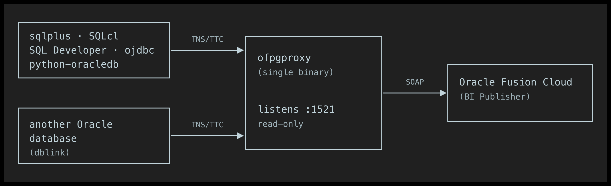

<div align="center">
  

  <h1>✨ oratofusionproxy</h1>
  <p><strong>Query Oracle Fusion Cloud with the Oracle clients you already have — SQLcl, DBeaver, SQL Developer, ojdbc, python-oracledb, and a real Oracle database's own <code>dblink</code>.</strong></p>
  <p>One binary between your existing Oracle tooling and a SaaS tenant that only speaks SOAP.</p>

  <br />

  

  <br />
  <br />

  <a href="https://github.com/krokozyab/oracle-fusion-tns-proxy/releases/latest"></a>
  
  
  <!--[](https://github.com/krokozyab/oracle-fusion-tns-proxy/releases)-->

  <br />
  <br />
</div>

Oracle Fusion Cloud's BI Publisher is the only sanctioned read-path out of a SaaS tenant. It speaks SOAP, returns base64-wrapped XML — and every Oracle client you already own (SQLcl, DBeaver, a reconciliation script over `dblink`, an ojdbc-based service) expects the real Oracle wire protocol instead.

**`oratofusionproxy` sits between them and makes them agree.**

```text
                   Oracle clients
       (SQLcl, DBeaver, SQL Developer, ojdbc,
     python-oracledb, another database's dblink)
                          │
                          │  Oracle Net (TNS/TTC)
                          ▼
                ┌──────────────────┐
                │ oratofusionproxy │
                └──────────────────┘
                          │
                          │  SOAP (BI Publisher · RP_ARB.xdo)
                          ▼
             Oracle Fusion Cloud tenant
```

### 🎯 Native Oracle, no rewrite required

Point existing Oracle tooling straight at Fusion — nothing to port:
*   **SQLcl, DBeaver, SQL Developer** — point them at Fusion and run your `SELECT`s, no rewrite. Tree navigation, autocomplete and result grids intact. (`sqlplus` works too.)
*   **A real Oracle database's own `dblink`** — reconciliation scripts, migration validation, anything already written to query a remote Oracle schema keeps working unchanged. Verified live from a 19c initiator and from the 23ai/26ai protocol generation (exercised with 26ai).
*   **ojdbc / python-oracledb** — service code that already speaks the Oracle driver connects without touching a line.
*   *Read-only by construction — BI Publisher can't write, so DML is rejected regardless of client.*

## 💡 Why you need this

* **Reuse the Oracle stack you already have:** reconcile an EBS (or any Oracle) database against Fusion straight over its own `dblink` — [step-by-step for R12](doc/r12-dblink.md), and no Database Gateway or `dg4odbc` involved — pull Fusion data into OIC flows and existing PL/SQL, run your `sqlplus` scripts and SQL Developer habits — all unchanged. Cut out the staging tables, nightly exports, and throwaway integrations you'd otherwise build just to move the data around.
* **Stop fighting the reporting bottleneck:** query the tenant directly from the client you already have, instead of waiting weeks for a custom pipeline or authoring a BI Publisher report per question.
* **Keep the tools you already know:** every Oracle client you own connects natively. Nothing new to learn, no SDK, no custom integration.

## 🚀 60-Second Magic Start

**Prerequisite:** Deploy the `RP_ARB.xdo` BI Publisher report to your Oracle Fusion tenant (catalog: [krokozyab/ofjdbc/otbireport](https://github.com/krokozyab/ofjdbc/tree/master/otbireport)) and make sure the account you'll authenticate as can run it. Three requirements in total, all inside Fusion — **[Fusion prerequisites](doc/fusion-prerequisites.md)** spells them out and shows how to verify all three with one command.

```bash
# 1. Grab the binary from the latest release:
#    https://github.com/krokozyab/oracle-fusion-tns-proxy/releases/latest
./oratofusionproxy --version

# 2. Point it at your Oracle Fusion tenant.
#    --oracle-password is a value YOU choose here and now; it is not a Fusion
#    password. Every Oracle client will log in with this exact string.
FUSION_HOST=fa-xxxx.oraclecloud.com FUSION_AUTH_TYPE=sso \
  ./oratofusionproxy --oracle-listen 127.0.0.1:1521 --oracle-password changeme

# 3. Connect with a real Oracle client — SQLcl here, one download, no
#    Instant Client needed. user = FUSION, password = the --oracle-password
#    value above, service name = anything.
sql FUSION/changeme@//127.0.0.1:1521/fusion
```

**The two credential rules**, because they are not the ones you expect:

- **Username: anything.** It is not validated and does not change what you
  see. Every object the proxy reports is owned by one logical schema, `FUSION`,
  whoever you log in as — the SQL `USER` function answers `FUSION` too.
- **Password = your `--oracle-password` / `ORACLE_WIRE_PASSWORD` value.** This
  is the one thing that *is* validated. It is not your Fusion password: Fusion
  credentials are what the proxy uses on its own side (`--auth`), and clients
  never see them.

The service name is ignored — put anything after the `/`.

*First run opens your IdP in Chrome; the SSO token is then held in-process. If your tenant supports it, standard basic authentication (`--auth=password`) is also available.*

The data-dictionary catalog needs no setup: the proxy keeps its own cache next to the binary and fills it from your tenant as you use it — the table list on first use, a table's columns the first time a client asks. One BI Publisher call each, kept for good. `oratofusionproxy warm-metadata` fills it in one go if you'd rather not wait.

👉 **[Read the Full Quick Start Guide](doc/quickstart.md)** · **[Connecting Oracle clients](doc/clients.md#oracle-clients-sqlcl-dbeaver-sql-developer)**

## 🧭 Rather not use a command line?

Put a file called **`.env`** next to the binary and double-click it. The proxy
reads that file at startup, so a whole configuration is five lines of text:

```ini
FUSION_HOST=fa-xxxx-dev1-saasfaprod1.fa.ocs.oraclecloud.com
FUSION_SQL_REPORT_PATH=/Custom/Financials/RP_ARB.xdo
FUSION_AUTH_TYPE=sso
OFPG_ORACLE_LISTEN=127.0.0.1:1521
ORACLE_WIRE_PASSWORD=choose-something-here
```

A console window opens and stays open — that window *is* the proxy, and closing
it stops it. Wait for `Oracle-wire (TNS) listening on 127.0.0.1:1521`, then point
any Oracle client at `127.0.0.1:1521/fusion` with user `FUSION` and the password
you just invented — a SQL editor, a BI tool, a spreadsheet, a script, all the
same three values. `oratofusionproxy doctor` checks the whole setup without
involving a client at all.

👉 **[Setting it up, step by step](doc/setup.md)**

## 🦸‍♂️ What you get out of the box

* 🔌 **Zero custom glue.** No specialized SDKs or custom integrations — if your tool speaks to an Oracle database, it already speaks to Fusion.
* 🔶 **The real wire protocol (TNS/TTC).** SQLcl, DBeaver, SQL Developer, ojdbc, python-oracledb and a real Oracle database's own `dblink` connect over the actual protocol bytes — a from-scratch implementation, not an emulation layer bolted onto a driver.
* 📚 **A catalog that builds itself.** Schema browsing is answered locally from a DuckDB catalog the proxy fills from your tenant on demand, so an IDE's tree never costs a slow round trip twice.
* 🌊 **Paged, not piled up.** GUI clients get their results in pages, so a wide table's first screen arrives in seconds and the proxy holds one page at a time. An unbounded query from a code client is one backend call and is held whole — bound it with `ROWNUM` and the footprint stays small.
* 🔒 **Read-only by design.** BI Publisher can't write, and neither will the proxy. No accidental DML. Sleep soundly.
* 🩺 **Built-in `doctor`.** `oratofusionproxy doctor` validates config, catalog health and Fusion reachability — and reports exactly which Oracle client/dialect combinations this build has verified — before you ever point a real client at it. [Details](doc/configuration.md#oratofusionproxy-doctor).

## 📖 Documentation

| Guide | Description |
|---|---|
| 🏎️ [**Quick Start**](doc/quickstart.md) | Zero to your first `SELECT` in 5 minutes |
| 🧭 [**Setting it up**](doc/setup.md) | Step by step, no command line: the `.env` file, starting it, connecting any client |
| 🤝 [**Connecting clients**](doc/clients.md) | Recipes for SQLcl, DBeaver, SQL Developer, `dblink`, ojdbc, python-oracledb |
| ⚙️ [**Configuration**](doc/configuration.md) | Flags, env vars, ports, `oratofusionproxy doctor`, and signals |
| 🔑 [**Authentication**](doc/auth.md) | SSO, password, token-file, and OAuth (refresh / client-credentials / JWT-assertion) modes |
| 🏛️ [**Fusion prerequisites**](doc/fusion-prerequisites.md) | What must exist in the tenant: the report, the account's rights, the endpoint — and how to verify them |
| 🔗 [**EBS R12 over `dblink`**](doc/r12-dblink.md) | Copy-paste recipe for reading Fusion from an R12 database, versions covered, DBA notes |
| 🚦 [**Limits & guardrails**](doc/limits.md) | Concurrency, result sizes, timeouts, cancellation, large types — what one query costs the tenant |
| 🧪 [**Testing & verification**](doc/testing.md) | What's actually verified, against which Oracle versions and clients — and what isn't |
| 📈 [**Observability**](doc/observability.md) | Prometheus `/metrics`, `/healthz`, `/readyz` |
| 🗂️ [**Metadata catalog**](doc/metadata.md) | What the catalog holds, how it fills itself, and how to refresh it |
| 🚑 [**Troubleshooting**](doc/troubleshooting.md) | Common errors, what they mean, and how to fix them |
| 💻 [**Examples**](examples/) | Four runnable programs — Python, Java, C#, Go — reading the same ten invoices out of Fusion |

## 🕹️ How it feels in practice

You run the binary. You get an Oracle listener on `:1521` — except the tables behind it are Oracle Fusion's.

Everything that speaks to an Oracle database just connects: SQLcl, DBeaver, SQL Developer, a real Oracle database's `dblink`, a Python script using python-oracledb, a JVM service on ojdbc — `sqlplus` too, if that is still what you reach for. Each query transparently becomes a BI Publisher SOAP call under the hood; rows stream back as the XML arrives.

**Your tools never find out it isn't a real database.**

*Actively developed. Expect rough edges on exotic SQL shapes and unverified client/dialect combinations — `oratofusionproxy doctor --profiles` shows exactly what's covered today, and [Testing & verification](doc/testing.md) has the full matrix. Open an issue when you hit one.*

## 💻 Reading Fusion from your own code

Four small programs, one per ecosystem, that do the same thing: connect, read
ten invoices out of `ap_invoices_all`, print them.

| | driver | run |
|---|---|---|
| [Python](examples/python/) | `python-oracledb` (thin, pure Python) | `python invoices.py` |
| [Java](examples/java/) | Oracle JDBC thin (`ojdbc11`) | `java -cp ojdbc11.jar Invoices.java` |
| [C#](examples/csharp/) | `Oracle.ManagedDataAccess.Core` | `dotnet run` |
| [Go](examples/go/) | `github.com/sijms/go-ora/v2` (pure Go) | `go run invoices.go` |

**What matters is what is not in them.** No proxy-specific driver, no shim, no
custom connector, no SDK — each one takes its language's ordinary Oracle client
and hands it a host and a port. That is the entire claim this project makes,
and these are the shortest honest way to show it.

Two of those drivers are what real tools use underneath — ojdbc is SQL
Developer and DBeaver, managed ODP.NET is Power BI and SSIS — so the demos also
stand in for the paths most people actually arrive on. All four were run
against a live Fusion tenant through the proxy and return the same rows.

👉 **[All four, with setup notes](examples/)**

## ⚖️ Independence & trademarks

`oratofusionproxy` is an independent, third-party tool. It is **not affiliated with, endorsed by, sponsored by, or supported by Oracle Corporation.**

"Oracle", "Oracle Fusion Cloud", "Oracle Net", "SQL Developer", and "SQLcl" are trademarks or registered trademarks of Oracle and/or its affiliates. They are used here only descriptively — to state what `oratofusionproxy` interoperates with — and no affiliation or endorsement is implied.

`oratofusionproxy` reads your tenant **only through Oracle's own documented BI Publisher web service** — the interface Oracle provides for this — authenticating with credentials **you** supply. It bundles no Oracle software and copies no Oracle source code; the Oracle Net (TNS/TTC) endpoint is an independent implementation whose sole purpose is protocol interoperability.

You are responsible for using `oratofusionproxy` in accordance with your own Oracle Cloud subscription terms, license agreements, and applicable law. Nothing here is legal advice — if you have doubts, talk to your own counsel.
