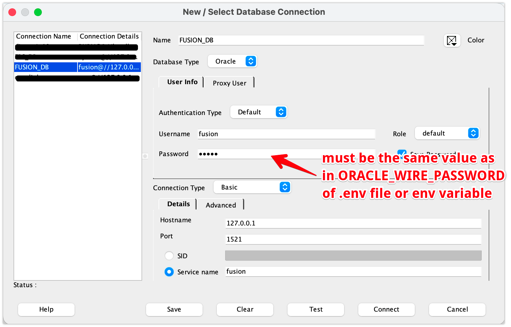

# Connecting clients

Oracle clients connect over TNS/TTC on `--oracle-listen` (there is no default —
set it, plus `--oracle-password`). Examples below assume the proxy on
`127.0.0.1:1521`.

## Oracle clients (SQLcl, DBeaver, SQL Developer)

Start the proxy with `--oracle-listen` (and `--oracle-password`) — see
[Configuration → Oracle-wire frontend](configuration.md#oracle-wire-frontend) —
and Oracle tooling connects on that port. Read-only: the proxy rejects any
write.

**Credentials — what to enter.** There is one shared password, **you choose**
it and set it with `--oracle-password` / `ORACLE_WIRE_PASSWORD`, and the client
must send that exact value:

- **Username** — not validated, and it does not change what you see either.
  Real access control is the Fusion session the proxy holds underneath. Every
  object is reported under one logical schema, `FUSION`, whoever you connect
  as: the tree tools ask the server which schema they are in
  (`SYS_CONTEXT('USERENV','CURRENT_SCHEMA')`) and the SQL `USER` function their
  other catalog queries use is answered server-side, and both say `FUSION`.
  Verified by connecting as `FUSION`, `fusion` and `ZZZ` — identical trees.
  `fusion` simply reads best in a connection list.
- **Password** — **the value you set** in `--oracle-password` /
  `ORACLE_WIRE_PASSWORD` (there's no default — the proxy won't start the Oracle
  listener without one). A wrong password fails the O5LOGON mutual handshake.
- **Service name / SID** — anything (e.g. `fusion`). It is ignored.

### SQLcl / python-oracledb

```bash
sql FUSION/changeme@127.0.0.1:1521/fusion
```

```python
import oracledb
oracledb.connect(user="FUSION", password="changeme", dsn="127.0.0.1:1521/fusion")
```

The username is arbitrary (`fusion` reads well), `changeme` stands for **your**
`--oracle-password` / `ORACLE_WIRE_PASSWORD` value, and the service name after
`/` is arbitrary too.

**Supported clients — thin AND thick drivers, each with its own verified
scope.** The Oracle-wire frontend supports both: **thin** (pure-Java /
pure-Python) drivers — SQL Developer, SQLcl, ojdbc, DBeaver's Oracle driver,
python-oracledb in thin mode — and **thick / OCI** clients built on a modern
(23ai-era) Instant Client, including `sqlplus` itself and a real Oracle
database's own `dblink` (see
[Oracle `dblink`](#oracle-dblink-a-real-oracle-database-as-the-client) below).
Thick clients negotiate the Oracle Advanced Networking (ANO / Native Network
Services) handshake that thin drivers skip; the proxy answers it with a
"no native security" selection, which modern Instant Client versions accept
transparently — no client-side configuration needed.

Exactly how far each client/dialect is verified — down to specific types,
bind variables, NULL handling, and column-count limits — is graded honestly
(not aspirationally) against the same registry `oratofusionproxy doctor --profiles`
reads; run that command against your own build for the full, evidence-graded
breakdown. None of this is a rejection — an unverified path just isn't
guaranteed, and `oratofusionproxy doctor` will warn (never block) when a connection
resolves to one.

**Still unsupported:** actually *enabling* ANO's native encryption
(`SQLNET.ENCRYPTION_CLIENT=REQUIRED`, TCPS in `sqlnet.ora`) — the proxy speaks
only unencrypted TCP TNS and advertises "no native security," so a client that
insists on encryption still fails. If you need transport encryption, terminate
TLS in front of the proxy instead (stunnel, a cloud load balancer, etc.).

### SQL Developer

New Connection → **Connection Type: Basic**:

| Field | Value |
|---|---|
| Username | Anything — `fusion` reads best. Not validated, and it does not affect what you see |
| Password | your `--oracle-password` value |
| Hostname | `127.0.0.1` |
| Port | `1521` (or your `--oracle-listen` port) |
| Service name | anything, e.g. `fusion` — pick **Service name**, not SID |

<p align="center">
  
</p>

The one field that has to be right is **Password**: it is the value you chose
for `ORACLE_WIRE_PASSWORD` (or `--oracle-password`), not a Fusion password.
Your Fusion credentials are configured on the proxy side and never travel from
the client. Everything else in the dialog is free-form — the username, the
service name, and the connection's own name are yours to pick.

**Test** → *Success*, then **Connect**. SQL Developer runs some data-dictionary
queries on connect; `ALL_*`/`USER_*`/`DBA_*` views are all answered locally
from `metadata.db` (not sent to Fusion) — including the "Tables"/"Views" tree
nodes' own `SYS.DBA_OBJECTS`-style queries. If the tree expands with **no
error but an empty list**, it is the catalog, not the username — see
[Troubleshooting](troubleshooting.md#sql-developer--vs-code-extension-tree-expands-with-no-error-but-no-tablesviews-listed).

### sqlplus

Works, but it is the least convenient option and the one with the narrowest
verified scope: it is an OCI (thick) client, which is a harder protocol path
than the thin drivers everything else here uses, and it needs a full Instant
Client install. **SQLcl is the drop-in replacement** — same command style,
single download, thin driver, better tested. Reach for `sqlplus` only if your
scripts already depend on it.

```bash
sqlplus FUSION/changeme@//127.0.0.1:1521/fusion
```

Same credentials as SQLcl above — `FUSION` is the recommended username (any
value authenticates, but IDE object trees only line up with the single logical
schema every object is reported under when you connect as `FUSION`), `changeme`
stands for your `--oracle-password` / `ORACLE_WIRE_PASSWORD` value, service
name after `/` is arbitrary.

Ordinary `SELECT`s work. Two things behave differently from a real database:

- **The `DESCRIBE` command** (sqlplus's own, a dedicated protocol call) is not
  implemented and returns `ORA-03001`. Query `ALL_TAB_COLUMNS` instead — that
  is answered locally and instantly.
- **PL/SQL is never executed.** Nothing on the other side can run it: BI
  Publisher executes a report, not a block. Statements the client marks as
  non-queries — `ALTER SESSION`, `COMMIT`, `ROLLBACK` and anonymous blocks —
  are *acknowledged* so the session keeps working, but their body does not run.
  Don't send a block expecting side effects.
- A write (DML/DDL) is refused with `ORA-16000`.

Verified scope for a direct `sqlplus` session is narrower than "ordinary
SELECTs" suggests — run `oratofusionproxy doctor --profiles` for the exact,
evidence-graded breakdown before relying on wide multi-column results, bind
variables, or NULL handling in a script.

### Oracle `dblink` (a real Oracle database as the client)

A real Oracle instance can reach Fusion through the proxy over its own native
`dblink`, so existing PL/SQL — reconciliation scripts, migration validation,
anything already written to query a remote Oracle schema with plain SQL —
can read Fusion data without going through OIC or authoring a BI Publisher
report per query:

```sql
CREATE DATABASE LINK fusion_link
  CONNECT TO "FUSION" IDENTIFIED BY "changeme"
  USING '(DESCRIPTION=(ADDRESS=(PROTOCOL=TCP)(HOST=<proxy-host>)(PORT=1521))
          (CONNECT_DATA=(SERVICE_NAME=fusion)))';

SELECT je_header_id, accounted_dr
FROM   gl_je_lines@fusion_link
WHERE  ROWNUM <= 5;
```

Same credential rules as above: the `IDENTIFIED BY` value must be **your**
`--oracle-password` / `ORACLE_WIRE_PASSWORD` value; the `CONNECT TO` username
is not validated.

**Keep the double quotes.** Without them Oracle upper-cases the password when
it stores the link, so a lowercase `--oracle-password` turns into `CHANGEME` on
the wire and every use of the link fails with `ORA-01017` — with nothing in the
statement to suggest why.

Read-only, same as every other Oracle-wire client — any DML over the link is
rejected. The proxy's own network reachability from wherever the real Oracle
instance runs is on you (VPN, a reverse tunnel, or routing the two onto the
same network) — the proxy doesn't do any of that itself.

`dblink` is the one dialect verified for **wide results (>255 columns)** —
confirmed against a real 288-column, all-NUMBER table capture. Run
`oratofusionproxy doctor --profiles` for the full per-feature grading.

For an EBS R12 database specifically — `tnsnames.ora`, which database versions
are covered, why no Database Gateway is involved, and the DBA-facing notes —
see [Reading Fusion from EBS R12 over `dblink`](r12-dblink.md).

## GUI clients (DBeaver, DataGrip, JetBrains IDEs)

Create an **Oracle** connection and use the same fields as
[SQL Developer above](#sql-developer): Username anything (`fusion` reads
best), Password = your `--oracle-password` / `ORACLE_WIRE_PASSWORD` value,
host/port from `--oracle-listen`, service name anything.

- Tables appear under the single logical schema `FUSION`.
- The tree, column lists and autocomplete are answered from the local metadata
  catalog (the client asks `ALL_TAB_COLUMNS` and friends), so browsing costs no
  BI Publisher calls.
- Result grids paginate: the first page (default 200 rows) arrives in seconds
  even on large tables, and more pages fetch as you scroll. Adjust with
  `--foreign-batch-size`.

## Code clients

### python-oracledb (thin)

```python
import oracledb

dsn = oracledb.makedsn("127.0.0.1", 1521, service_name="fusion")
with oracledb.connect(user="FUSION", password="changeme", dsn=dsn) as conn:
    cur = conn.cursor()
    cur.execute("SELECT period_name, period_year FROM gl_periods WHERE ROWNUM <= 5")
    for row in cur:
        print(row)
```

Thin mode only — no Instant Client needed. Bind variables (positional and
named) work.

### ojdbc (Java / Kotlin)

```java
var url = "jdbc:oracle:thin:@//127.0.0.1:1521/fusion";
try (var conn = DriverManager.getConnection(url, "FUSION", "changeme");
     var st = conn.createStatement();
     var rs = st.executeQuery("SELECT period_name FROM gl_periods WHERE ROWNUM <= 5")) {
    while (rs.next()) System.out.println(rs.getString(1));
}
```

The thin driver is what DBeaver, SQL Developer and SQLcl use underneath, so
anything that works there works here.

## Pagination

| Client kind | Behaviour | How to change |
|---|---|---|
| GUI clients (DBeaver, DataGrip, SQL Developer, …) | OFFSET/FETCH batching — first page fast, more pages on scroll | `--foreign-batch-size N` (0 disables) |
| Code clients, `sqlplus`, `dblink` | Single SOAP call for the whole result | Add `ROWNUM <= n` or `FETCH FIRST n ROWS ONLY` in the query |

## Troubleshooting

See [Troubleshooting](troubleshooting.md) for specific client errors: slow
queries, empty schema trees, type mismatches, and more.
